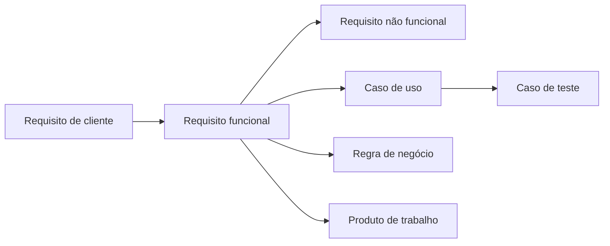

---
tags:
  - moc
  - sebras
aliases:
  - Cérebro Sebras
  - Norte do projeto
---

# Cérebro Sebras

Este vault é o **norte de negócio** do Sistema Eleitoral Brasileiro (Sebras).  
Alterações de código vêm **depois**. Primeiro consultamos, rastreamos e classificamos aqui.

## Como navegar

1. Leia [[Como-usar]]
2. Entenda o domínio em [[Visao-do-produto]] e [[Regras-de-negocio]]
3. Veja o que já existe em [[Escopo-atual]]
4. Qualquer RF novo nasce em [[Catalogo-de-requisitos]] + [[Matriz-rastreabilidade-sebras]]
5. Toda mudança passa por [[Registro-de-mudancas]]

## Mapas

## Pastas

| Pasta | Papel |
|---|---|
| [[01-processo/Padrao-documental\|01-processo]] | Modelos oficiais (ERS, CU, SCM, ata, laudo, testes, rastreio) |
| [[02-negocio/Visao-do-produto\|02-negocio]] | Visão, glossário, regras e escopo do Sebras |
| [[03-requisitos/Catalogo-de-requisitos\|03-requisitos]] | RC / RF / RNF classificados e rastreados |
| [[04-casos-de-uso/Indice-casos-de-uso\|04-casos-de-uso]] | Detalhamento no molde do modelo de CU |
| [[05-testes/Plano-de-testes-sebras\|05-testes]] | Plano de testes no molde do documento recebido |
| [[06-mudancas/Registro-de-mudancas\|06-mudancas]] | Solicitações de mudança |
| [[07-atas/Indice-atas\|07-atas]] | Atas de reunião |
| [[99-fontes/Fontes\|99-fontes]] | Arquivos originais (.doc / .xls / .docx) |

## Estado atual do norte

- O código em `main` já cobre cadastros, voto, resultado e abstenção.
- O visual da branch `frontend` **não** entra neste cérebro como RF vigente.
- O `.docx` anexado é um **plano de testes de outro sistema** (Limite de Crédito). Usamos só a **forma**. O conteúdo de negócio do Sebras está em `02-negocio` e `03-requisitos`.
- Os `.xls` de classificação e rastreio vieram como **planilha-modelo** (exemplo de alunos/instituições). A instância Sebras está em [[Classificacao-priorizacao-sebras]] e [[Matriz-rastreabilidade-sebras]].
