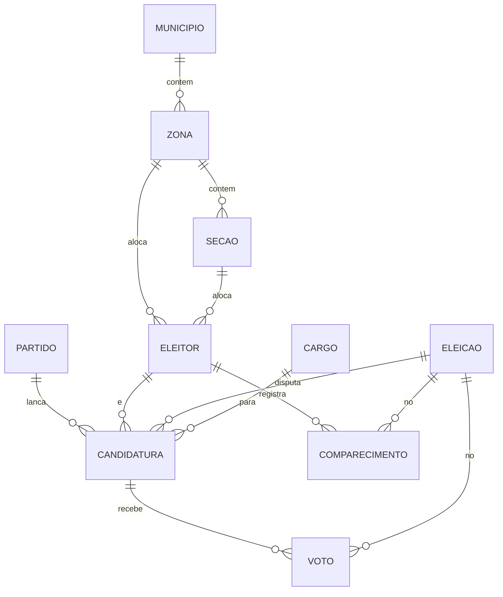

---
tags:
  - negocio
  - dados
---

# Entidades e persistência

Fonte de verdade do banco: `resource/schema.sql` (usuário `votacao`).  
O mesmo DDL está em [[schema-sebras]].

## Tabelas

| Tabela | PK | Observação |
|---|---|---|
| partido | id IDENTITY | numero, sigla, nome, ativo |
| municipio | id IDENTITY | nome, uf |
| zona | id IDENTITY | numero, municipio_id |
| secao | id IDENTITY | numero, zona_id, local |
| eleitor | id IDENTITY | titulo UNIQUE, zona+seção, ativo, votou |
| eleicao | id IDENTITY | ano, datas, turno_atual, 2º turno, ativa |
| cargo | id IDENTITY | nome, uf opcional, permite_segundo_turno |
| candidatura | id IDENTITY | eleitor+partido+eleicao+cargo+numero, ativa |
| voto | id IDENTITY | candidatura+eleicao+turno+zona+seção |
| comparecimento | id IDENTITY | UNIQUE (eleitor, eleicao, turno) |

## Relacionado

- [[Regras-de-negocio]]
- [[Escopo-atual]]
