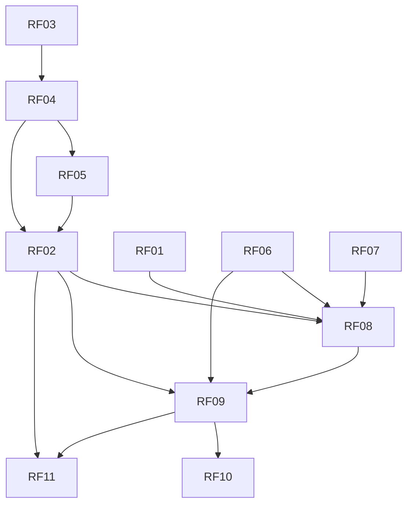

---
tags:
  - requisito
  - rastreabilidade
---

# Matriz de rastreabilidade — Sebras

Molde: [[Matriz-rastreabilidade]].

## RF × RC × CU × RN × código

| RF | RC | CU | RN | Produto / código |
|---|---|---|---|---|
| [[RF01]] | [[RC01]] | [[CU01]] | [[RN09]] | `PartidoServlet` · `partido` |
| [[RF02]] | [[RC02]] | [[CU02]] | [[RN04]] [[RN08]] | `EleitorServlet` · `eleitor` |
| [[RF03]] | [[RC03]] | [[CU03]] | — | `MunicipioServlet` · `municipio` |
| [[RF04]] | [[RC03]] | [[CU04]] | [[RN03]] | `ZonaServlet` · `zona` |
| [[RF05]] | [[RC03]] | [[CU05]] | [[RN03]] | `SecaoServlet` · `secao` |
| [[RF06]] | [[RC04]] | [[CU06]] | [[RN01]] [[RN02]] | `EleicaoServlet` · `eleicao` |
| [[RF07]] | [[RC04]] | [[CU07]] | [[RN05]] | `CargoServlet` · `cargo` |
| [[RF08]] | [[RC04]] | [[CU08]] | [[RN05]] | `CandidaturaServlet` · `candidatura` |
| [[RF09]] | [[RC05]] | [[CU09]] | [[RN01]]–[[RN07]] | `VotoServlet` · `VotacaoService` |
| [[RF10]] | [[RC06]] | [[CU10]] | [[RN10]] | `ResultadoServlet` |
| [[RF11]] | [[RC07]] | [[CU11]] | [[RN10]] | `AbstencaoServlet` |

## RF × RNF

| RF | RNF |
|---|---|
| RF01–RF11 | [[RNF01]] [[RNF02]] [[RNF03]] [[RNF04]] [[RNF06]] |
| [[RF09]] | [[RNF05]] |
| todos | [[RNF07]] (sem login) · [[RNF08]] (UI adiada) |

## RF × RF (dependência)

## Produtos de trabalho

| PT | Descrição | RF |
|---|---|---|
| PT-ERS | Este cérebro / catálogo | todos |
| PT-SCHEMA | `resource/schema.sql` · [[schema-sebras]] | todos |
| PT-WAR | `target/sebras.war` | todos |
| PT-TESTES | [[Plano-de-testes-sebras]] | RF01–RF11 |
